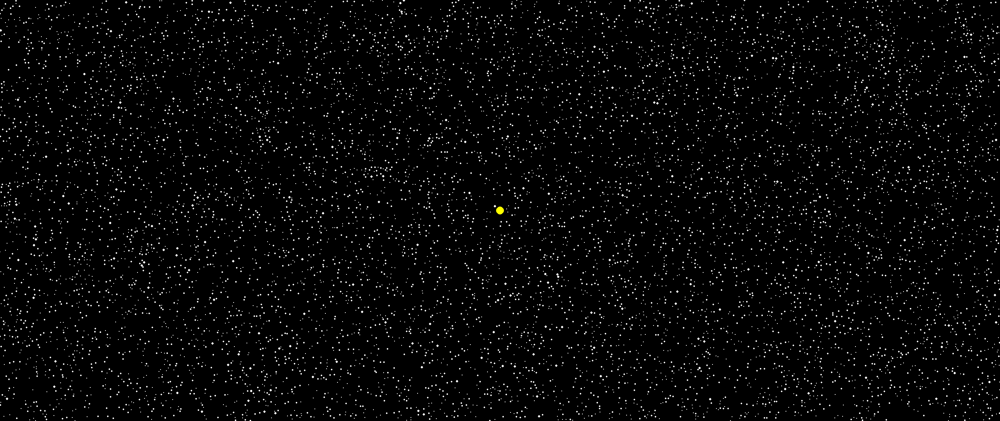
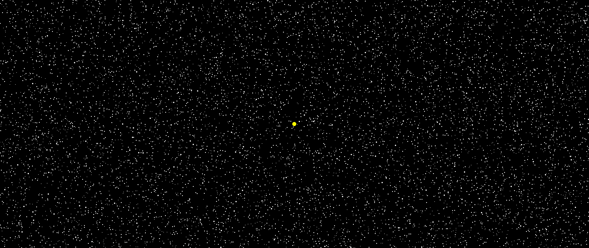
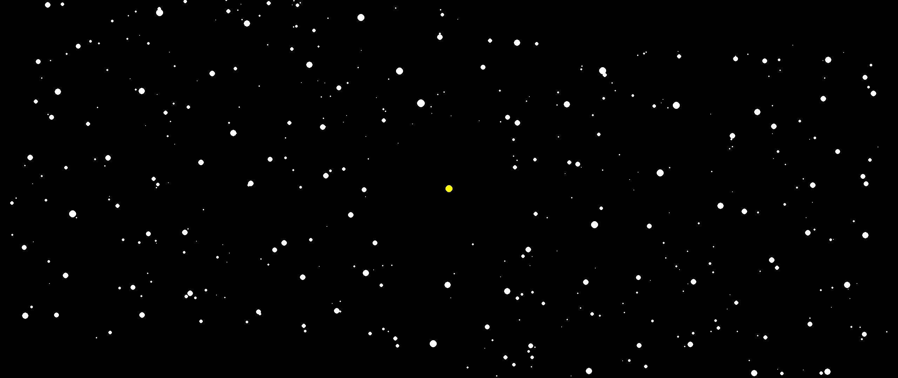

# 🌌 Solar System Simulator

Welcome to the **Solar System Simulator**! This project is an interactive and dynamic simulation of a solar system where thousands of particles orbit around a central sun, collide, merge, and form larger celestial bodies. Experience the mesmerizing dance of gravity and motion in a visually stunning display.

<p align="center">
  
</p>

> **Note:** This project was initially developed in one day, with subsequent enhancements and optimizations added later.

---

## 🚀 Features

- **Massive Particle Simulation:**
  - Starts with **10,000 objects** by default, creating a rich and dense environment.
  - The number of objects can be easily adjusted to suit your preferences or hardware capabilities.

- **Realistic Physics:**
  - Particles experience gravitational forces and are attracted to the sun regardless of their distance.
  - Collisions between particles result in merging, with masses and velocities adjusted according to conservation laws.

- **Orbital Mechanics:**
  - Particles are initialized with tangential velocities, causing them to orbit the sun realistically.
  - Initial velocities can be scaled to create more energetic orbits.

- **Interactive Controls:**
  - **Smooth Exit:** Press the `ESC` key or close the window to gracefully exit the simulation.

- **Performance Optimizations:**
  - **Spatial Partitioning:** Utilizes a grid-based neighbor search to optimize force calculations, significantly reducing computational complexity.
  - **Distance Culling:** Gravitational forces are only calculated between nearby particles, enhancing performance without sacrificing visual accuracy.
  - **Object Cleanup:**
    - Particles that move far from the sun are removed to maintain simulation efficiency.
    - Inactive particles resulting from collisions are cleaned up in the background.
  - **Multithreading:** Simulation runs efficiently, handling large numbers of particles smoothly.

---

## 🛠️ Installation

### Prerequisites

- **Python 3.8+**
- **Pygame**
- **NumPy**
- **Numba**

### Steps

1. **Clone the Repository:**

   ```bash
   git clone https://github.com/quintant/SolarSystemSimulation.git
   ```

2. **Navigate to the Project Directory:**

   ```bash
   cd solar-system-simulator
   ```

3. **Install Dependencies:**

   ```bash
   pip install -r requirements.txt
   ```

   > **Note:** Ensure that you have a compatible version of Python and all required libraries installed.

---

## 🎮 Usage

1. **Run the Simulation:**

   ```bash
   python main.py
   ```

2. **Interact with the Simulation:**

   - **Exit Simulation:** Press the `ESC` key or click the close button on the window to exit smoothly.
   - **Adjust Parameters:** Modify variables in the `main.py` and `spaceManager.py` files to change the number of particles, initial velocities, and other settings.

---

## 🔧 Configuration

You can customize the simulation by adjusting parameters in the `main.py` and `spaceManager.py` files:

### In `main.py`:

- **Number of Objects:**

  ```python
  NUM_OBJECTS = 10_000  # Adjust the number of particles
  ```

- **Screen Mode:**

  ```python
  screen = pygame.display.set_mode((0, 0), pygame.FULLSCREEN)  # Fullscreen mode
  # To use windowed mode, specify dimensions:
  # screen = pygame.display.set_mode((800, 600))
  ```

### In `spaceManager.py`:

- **Initial Velocity Scale:**

  ```python
  space_manager = SpaceManager(velocity_scale=2.0)  # Increase for higher initial velocities
  ```

- **Collision Distance:**

  ```python
  self.collision_distance = 5  # Adjust for collision sensitivity
  ```

- **Gravitational Constant:**

  ```python
  G = 1e-3  # Modify to change gravitational strength
  ```

- **Particle Mass Range:**

  ```python
  self.obj_mass = np.abs(np.random.randn(self.numObjects) * 10)  # Adjust mass distribution
  ```

---

## 📈 Optimizations

- **Grid-Based Neighbor Search:**
  - Particles are organized into a grid to limit force calculations to nearby neighbors.
  - Reduces computational complexity from O(N²) to approximately O(N).

- **Distance-Based Force Calculation:**
  - Gravitational forces are only calculated for particles within a certain distance.
  - Ensures that distant particles do not unnecessarily consume computational resources.

- **Inactive Particle Cleanup:**
  - Particles that are too far from the sun or have merged are removed from active calculations.
  - Keeps the simulation running smoothly as particles merge and the number of active particles decreases.

- **Efficient Rendering:**
  - Particles are drawn as circles with radii proportional to the cube root of their mass.
  - Inactive particles are effectively removed from the screen to maintain visual accuracy.

---

## 📷 Screenshots

<p align="center">
  
  <br>
  
</p>

---

## 🧰 Technologies Used

- **Python:** The core programming language used for the simulation.
- **Pygame:** Handles rendering and user interaction.
- **NumPy:** Provides efficient numerical computations and array handling.
- **Numba:** Accelerates performance-critical functions using JIT compilation.

---

## 🌟 Future Improvements

- **User Interaction:**
  - Allow spawning new particles by mouse clicks with specified velocities and masses.
  - Implement real-time parameter adjustments through keyboard input or GUI controls.

- **3D Simulation:**
  - Extend the simulation to three dimensions for a more realistic representation.

- **Advanced Physics:**
  - Include more complex gravitational interactions and relativistic effects.
  - Implement different types of celestial bodies with unique properties.

- **Data Visualization:**
  - Add graphs and charts to display simulation data like particle velocities, distances, and mass distributions.

---

## 📄 License

This project is licensed under the [MIT License](LICENSE).

---

## 🙏 Acknowledgements

- **Pygame Community:** For providing extensive resources and tutorials on game development.
- **Numba Developers:** For enabling high-performance computations in Python.

---

## 💡 Inspiration

This project was inspired by a fascination with astronomy and physics, aiming to create a visual and interactive representation of gravitational interactions in a solar system. Initially developed in a single day, it has since evolved with optimizations and enhancements to provide a more engaging and educational experience.

---

## 📝 Contact

For questions, suggestions, or contributions, please feel free to reach out:

- **GitHub:** [quintant](https://github.com/quintant)

---

<p align="center">
  <em>"Somewhere, something incredible is waiting to be known." – Carl Sagan</em>
</p>

---

## 🗂️ File Structure

```
solar-system-simulator/
│
├── main.py                # The main script to run the simulation
├── spaceManager.py        # Contains the SpaceManager class and simulation logic
├── requirements.txt       # List of dependencies
├── README.md              # This file
└── LICENSE                # License information
```

---

## 📝 Code Overview

### `main.py`

- **Initialization:**
  - Sets up the Pygame environment and creates a fullscreen window.
  - Retrieves the screen dimensions to pass to the `SpaceManager`.
- **Simulation Loop:**
  - Runs the main loop that keeps the simulation running.
  - Handles user input to allow for a smooth exit using the `ESC` key.
  - Calls the `iterate` function from `SpaceManager` to update the simulation each frame.

### `spaceManager.py`

- **`SpaceManager` Class:**
  - Manages all aspects of the simulation, including particle initialization, force calculations, collision handling, and rendering.
- **Key Methods:**
  - `__init__`: Initializes particles, assigns initial positions and velocities, and sets up simulation parameters.
  - `iterate`: Updates particle positions and velocities, handles collisions, and renders particles on the screen.
- **Physics Implementation:**
  - **Gravitational Forces:** Calculated using Newton's law of universal gravitation, optimized with spatial partitioning.
  - **Collision Handling:** Detects when particles are close enough to collide and merges them, conserving mass and momentum.
  - **Velocity Initialization:** Particles start with tangential velocities for realistic orbital motion, with a scalable velocity factor.

---

## ⚠️ Notes

- **Compatibility:**
  - Ensure that your Python version is compatible with the libraries used, especially Numba and Pygame.
- **Performance:**
  - Simulating a large number of particles can be computationally intensive. Adjust `NUM_OBJECTS` in `main.py` according to your system's capabilities.
- **Fullscreen Mode:**
  - The simulation runs in fullscreen by default. To run it in windowed mode, modify the `pygame.display.set_mode` call in `main.py`.

---

## 🤝 Contributing

Contributions are welcome! If you'd like to contribute to this project, please:

1. Fork the repository.
2. Create a new branch for your feature or bug fix.
3. Commit your changes with descriptive messages.
4. Push your branch and create a pull request.

---

## 📚 References

- **Pygame Documentation:** [https://www.pygame.org/docs/](https://www.pygame.org/docs/)
- **NumPy Documentation:** [https://numpy.org/doc/](https://numpy.org/doc/)
- **Numba Documentation:** [https://numba.pydata.org/numba-doc/latest/](https://numba.pydata.org/numba-doc/latest/)
- **Gravitational Physics:** [https://en.wikipedia.org/wiki/Newton%27s_law_of_universal_gravitation](https://en.wikipedia.org/wiki/Newton%27s_law_of_universal_gravitation)

---

Enjoy exploring the universe you've created! 🚀🌠